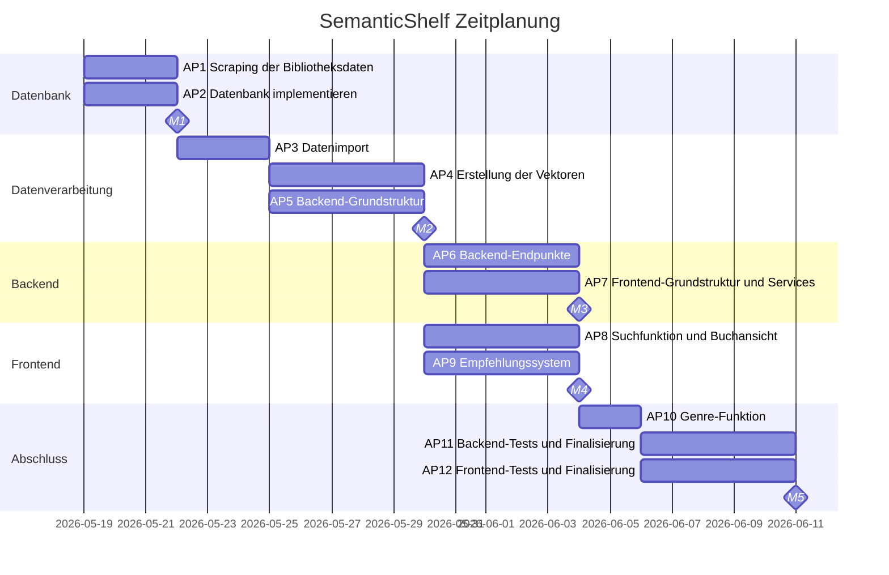

# Schritt 5: Zeitplanung

```mermaid
gantt
    title SemanticShelf Zeitplanung
    dateFormat YYYY-MM-DD

    section Datenbank
    AP1 Scraping der Bibliotheksdaten          :2026-05-19, 3d
    AP2 Datenbank implementieren               :2026-05-19, 3d
    M1                                         :milestone, 2026-05-22, 0d

    section Datenverarbeitung
    AP3 Datenimport                            :2026-05-22, 3d
    AP4 Erstellung der Vektoren                :2026-05-25, 5d
    AP5 Backend-Grundstruktur                  :2026-05-25, 5d
    M2                                         :milestone, 2026-05-30, 0d

    section Backend
    AP6 Backend-Endpunkte                      :2026-05-30, 5d
    AP7 Frontend-Grundstruktur und Services    :2026-05-30, 5d
    M3                                         :milestone, 2026-06-04, 0d

    section Frontend
    AP8 Suchfunktion und Buchansicht           :2026-05-30, 5d
    AP9 Empfehlungssystem                      :2026-05-30, 5d
    M4                                         :milestone, 2026-06-04, 0d

    section Abschluss
    AP10 Genre-Funktion                        :2026-06-04, 2d
    AP11 Backend-Tests und Finalisierung       :2026-06-06, 5d
    AP12 Frontend-Tests und Finalisierung      :2026-06-06, 5d
    M5                                         :milestone, 2026-06-11, 0d
```